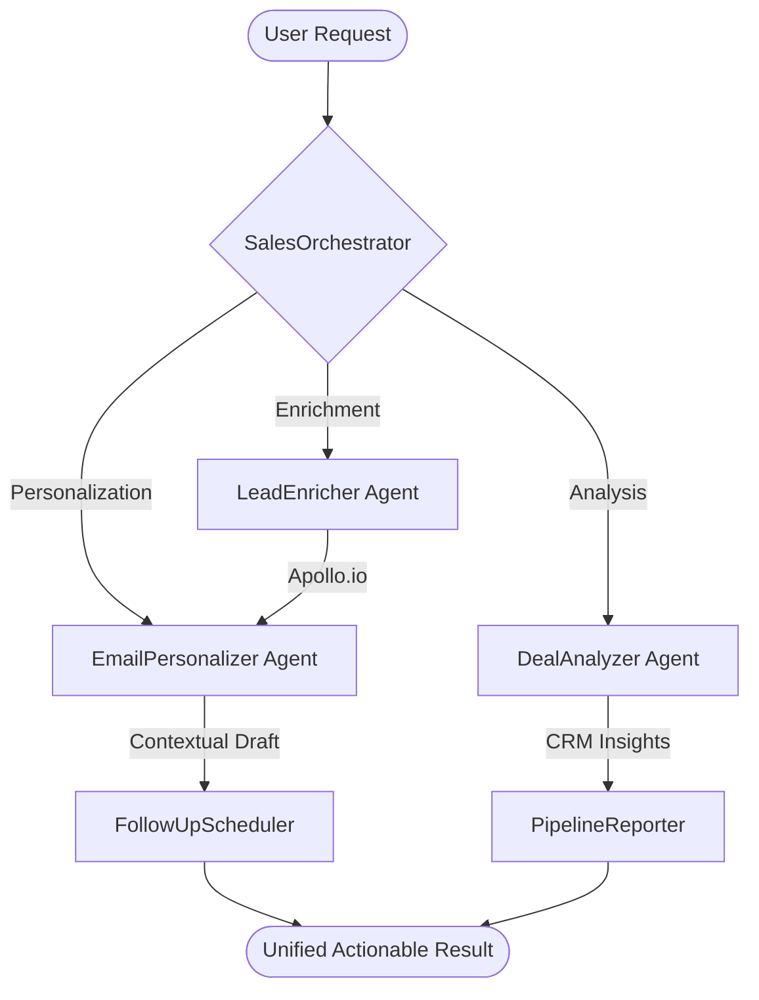

# 🌌 SalesIQ: The Autonomous Revenue OS

<div align="center">


[](https://github.com/daniellopez882/AI-powered-Sales-CRM-Agent/actions/workflows/ci-cd.yml)
[](Dockerfile)
[](integrations/cache.py)
[](https://github.com/langchain-ai/langgraph)

**Stop chasing leads. Start closing them.**  
*SalesIQ is a production-grade Agentic AI system that automates the entire B2B sales funnel — from signal to suite.*

[Explore Docs](/docs) • [View Demo](#demo) • [Report Bug](https://github.com/daniellopez882/AI-powered-Sales-CRM-Agent/issues)

</div>

---

## 🚀 The Vision

Modern sales stacks are fragmented. **SalesIQ** fixes this by deploying a "Digital Sales Floor" — a coordinated crew of specialized AI agents that work 24/7 to enrich leads, personalize outreach, and predict deal outcomes. It’s not a tool; it’s an autonomous teammate.

## 🧠 The Agentic Engine

Built on **LangGraph**, SalesIQ uses a sophisticated "Supervisor-Worker" orchestration pattern to ensure high-fidelity outputs and deterministic routing.



---

## 💎 Premium Features

### 🕵️ Intelligence Layer
*   **Deep Enrichment**: Integrates with **Apollo.io** to fetch verified emails, LinkedIn profiles, and company firmographics.
*   **Intent Scoring**: Automatically calculates ICP fit using a weighted 6-dimension formula.

### 🛡️ Production Hardened
*   **Zero-Trust Security**: Pre-configured `X-API-Key` auth and sliding-window rate limiting.
*   **PII Masking**: Advanced regex patterns automatically strip sensitive data (emails, phones) from all structured logs.
*   **Sentry Monitoring**: Integrated error tracking with asynchronous breadcrumb capture.

### ⚡ Built for Scale
*   **Redis Caching**: Enrichment results are cached for 7 days, reducing latency by 90% and slashing API costs.
*   **Persistent Sessions**: SQLite-backed checkpointing allows long-running sales cycles to survive infrastructure restarts.
*   **Async First**: Fully non-blocking FastAPI implementation using `ainvoke` for high-concurrency environments.

---

## 🛠️ Operational Stack

| Category | Technology |
| :--- | :--- |
| **Orchestration** | LangGraph, CrewAI, LangChain |
| **Integrations** | Apollo.io, HubSpot, Slack, Gmail |
| **Infrastructure** | Redis, SQLite, Docker, Python 3.11 |
| **API Framework** | FastAPI, Pydantic v2, SlowAPI |
| **Observability** | Structlog, Sentry, LangSmith |

---

## � Deployment

### The 1-Minute Launch (Docker)
```bash
# Clone the repository
git clone https://github.com/daniellopez882/AI-powered-Sales-CRM-Agent.git
cd AI-powered-Sales-CRM-Agent

# Setup environment
cp .env.example .env

# Fire up the engine
docker-compose up -d
```
Access the Interactive API Playground at `http://localhost:8000/docs`.

---

## � Enterprise Compliance

SalesIQ is designed for the modern enterprise. It includes a built-in **Audit Logging** system that tracks:
- ✅ Every agent decision and routing choice.
- ✅ Data access events from external providers.
- ✅ Human escalation triggers.

---

<p align="center">
  Built with ❤️ by the SalesIQ Agentic Engineering Team.<br>
  <i>Empowering the next generation of Revenue Operations.</i>
</p>
