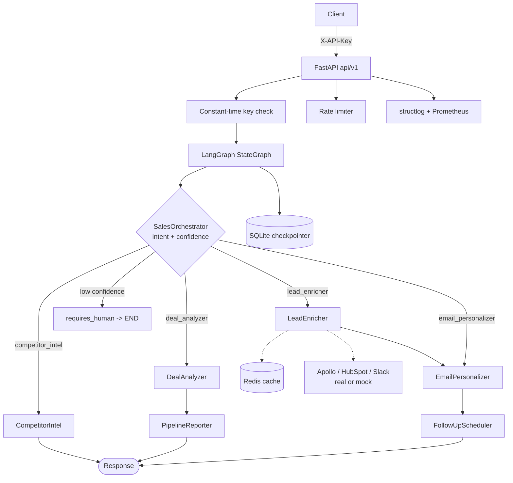

# SalesIQ

A multi-agent B2B sales assistant: it enriches inbound leads, drafts personalised
outreach, schedules follow-ups, and analyses deal pipelines behind an
authenticated HTTP API.

[](https://github.com/daniellopez882/AI-powered-Sales-CRM-Agent/actions/workflows/ci.yml)
[](https://github.com/daniellopez882/AI-powered-Sales-CRM-Agent/actions/workflows/security.yml)

---

## Why this exists

Lead research is repetitive and mechanical: look the person up, work out whether
they fit the ideal customer profile, write an opener that references something
real, decide when to follow up. Each step is cheap on its own and expensive in
aggregate.

SalesIQ models that work as a small set of specialised agents behind a
supervisor, rather than one long prompt. The supervisor classifies intent and
routes to exactly one worker; each worker owns one job and writes its result
into shared state. That makes each step independently testable and keeps a
failure in one agent from corrupting the others.

## Architecture


```mermaid
flowchart TD
    Client[Client] -->|X-API-Key| API[FastAPI api/v1]
    API --> Auth[Constant-time key check]
    API --> RL[Rate limiter]
    Auth --> Graph[LangGraph StateGraph]

    Graph --> Orch{SalesOrchestrator<br/>intent + confidence}
    Orch -->|lead_enricher| LE[LeadEnricher]
    Orch -->|email_personalizer| EP[EmailPersonalizer]
    Orch -->|deal_analyzer| DA[DealAnalyzer]
    Orch -->|competitor_intel| CI[CompetitorIntel]
    Orch -->|low confidence| HUMAN[requires_human -> END]

    LE --> EP
    EP --> FS[FollowUpScheduler]
    DA --> PR[PipelineReporter]

    LE -.-> Cache[(Redis cache)]
    LE -.-> Apollo[Apollo / HubSpot / Slack<br/>real or mock]
    Graph --> CP[(SQLite checkpointer)]

    API --> Obs[structlog + Prometheus]
    FS --> Result([Response])
    PR --> Result
    CI --> Result
```

Every node in that diagram exists in the codebase. `graph/workflow.py` wires
the routing; `agents/` holds one module per worker.

### Request flow

1. `SalesRequest` is validated: control characters stripped, length capped,
   `session_id` must be a UUID.
2. The API key is compared in constant time; the rate limiter runs per client IP.
3. The orchestrator classifies the message and sets `next_agent` plus a
   confidence score. Low confidence or an accumulated error routes to `END`
   with `requires_human=true` rather than guessing.
4. The selected worker runs. Node wrappers catch exceptions, append to
   `state["errors"]`, and set `requires_human` instead of propagating.
5. State is checkpointed per `thread_id`, so a session can be resumed.

## Features

- Supervisor-worker orchestration on LangGraph, with named nodes and explicit routing
- Seven agents: orchestrator, lead enricher, email personaliser, follow-up
  scheduler, deal analyser, pipeline reporter, competitor intel
- Pluggable integrations (Apollo, HubSpot, Slack, Gmail) with mock
  implementations behind the same interfaces, on by default
- Redis caching with a no-op fallback, so the service runs without Redis
- Session checkpointing to SQLite, so long sales cycles survive a restart
- Structured JSON logs with PII masking
- Prometheus metrics, liveness and readiness endpoints
- API key auth, per-IP rate limiting, request-id correlation

## Technology

| Concern | Choice |
|---|---|
| Orchestration | LangGraph `StateGraph` with a SQLite checkpointer |
| Agents | CrewAI for the multi-step workers, LangChain for model access |
| API | FastAPI, Pydantic v2, slowapi |
| Cache | Redis 7 (optional) |
| Logging | structlog, JSON in production |
| Metrics | prometheus-client |
| Tests | pytest |
| Container | Python 3.12 slim, multi-stage, non-root |

## Repository structure

```
agents/          one module per agent, plus shared prompts
graph/           LangGraph state definition and workflow wiring
api/             FastAPI application, schemas, auth, probes
integrations/    vendor clients, mocks, Redis cache
observability/   Prometheus metric definitions
utils/           logging configuration, audit log
config/          typed settings
mcp_server/      Model Context Protocol server exposing the tools
benchmarks/      reproducible microbenchmarks
tests/           unit, integration and security tests
docs/            ADRs, threat model, deployment guide
```

## Quick start

```bash
git clone https://github.com/daniellopez882/AI-powered-Sales-CRM-Agent.git
cd AI-powered-Sales-CRM-Agent
cp .env.example .env
docker compose up --build
```

The API is then on `http://localhost:8000`; `/docs` has the OpenAPI UI outside
production. Without an LLM key the service still starts and answers `/health`,
`/ready` and `/metrics` — `/api/v1/chat` returns `503` with an explanation.

Without Docker:

```bash
make setup      # venv + dev dependencies + .env
make test
make dev
```

## Configuration

Everything is environment-driven; see [.env.example](.env.example). Nothing
machine-specific is baked into a default.

| Variable | Default | Notes |
|---|---|---|
| `OPENAI_API_KEY` / `ANTHROPIC_API_KEY` | unset | at least one required to run the graph |
| `API_SECRET_KEY` | `changeme-in-production` | **rejected** when `ENVIRONMENT=production` |
| `ENVIRONMENT` | `development` | `development` \| `testing` \| `staging` \| `production` |
| `USE_MOCK_INTEGRATIONS` | `true` | must be `false` in production |
| `CORS_ALLOW_ORIGINS` | empty | comma-separated; must be non-empty in production |
| `REDIS_URL` | `redis://localhost:6379/0` | absent Redis disables caching, it is not fatal |
| `RATE_LIMIT_PER_MINUTE` | `10` | per client IP |

Setting `ENVIRONMENT=production` runs a startup check that refuses to boot on a
placeholder secret, mock integrations, empty CORS, a missing LLM key, or missing
vendor credentials. Generate a real secret with `make secret`.

## API

Base path `/api/v1`. Operational endpoints are unversioned so probes stay stable.

| Method | Path | Auth | Purpose |
|---|---|---|---|
| GET | `/health` | none | Liveness. Touches no dependency. |
| GET | `/ready` | none | Readiness. `503` when a required check fails. |
| GET | `/metrics` | none | Prometheus exposition. |
| POST | `/api/v1/chat` | `X-API-Key` | Run a message through the agent graph. |

```bash
curl -X POST http://localhost:8000/api/v1/chat \
  -H "X-API-Key: $API_SECRET_KEY" \
  -H "Content-Type: application/json" \
  -d '{"user_id":"u-1","message":"Enrich jane@acme.com and draft an opener"}'
```

Errors use a consistent shape and never echo internal exception text:

```json
{"detail": {"code": "agent_pipeline_failed",
            "message": "The agent pipeline failed. Retry, or contact support with the request id.",
            "request_id": "0b0f…"}}
```

Every response carries `X-Request-ID`, matching the `request_id` on the
corresponding structured log lines.

## Security

Implemented:

- Constant-time API key comparison (`secrets.compare_digest`)
- Per-IP rate limiting
- Control-character stripping and length caps on all free-text input
- UUID validation on `session_id`, which is used as a checkpoint key
- PII masking (emails, phone numbers) in every log record
- Cache keys are SHA-256 hashes, so identifiers do not sit in the Redis keyspace
- Internal exception detail withheld from HTTP responses
- Container runs as UID 1001, not root; `.dockerignore` keeps `.env` and `.git`
  out of the image
- CI runs `pip-audit`, `bandit` and `gitleaks`

See [docs/threat-model.md](docs/threat-model.md) for trust boundaries, the
prompt-injection analysis, and the risks that remain open.

## Testing

```bash
make test         # everything
make test-fast    # skip anything needing Redis
```

105 tests: unit, integration and security.

The cache tests **skip rather than pass** when Redis is unreachable, and CI
fails the build if they skip. That is deliberate — the defect they cover only
appears when Redis is available, which is exactly why it survived so long
(see [ADR-003](docs/adr/003-cache-logging-contract.md)).

## Evaluation

Not yet implemented. Agent output quality — routing accuracy, ICP scoring,
draft quality, hallucination rate — is **not** measured in this repository.
Doing it honestly needs a labelled dataset and live model credentials.
It is the top item on the roadmap; the current suite tests plumbing, not
judgement, and the README will not claim otherwise until an eval harness exists.

## Observability

- **Logs** — structlog; JSON in production, console elsewhere. PII masked.
  uvicorn's access and error loggers are re-pointed at the same handler, so
  request logs are JSON too rather than uvicorn's plain text. Three startup
  lines stay unstructured (the entrypoint's config preflight and two from
  uvicorn's supervisor, both emitted before the app configures logging).
- **Metrics** — `/metrics`: `salesiq_requests_total`,
  `salesiq_request_latency_seconds`, `salesiq_errors_total`,
  `salesiq_agent_runs_total`, `salesiq_tool_calls_total`,
  `salesiq_tokens_total`, `salesiq_cache_events_total`.
- **Correlation** — `X-Request-ID` in, echoed out, bound to every log line.
- **Errors** — Sentry when `SENTRY_DSN` is set.

Prompt text and lead payloads are never used as metric labels: it would explode
label cardinality and push customer PII into the metrics store.

## Performance

Measured on the hardware named below with `python benchmarks/bench.py`.
Reproduce with `make bench`; raw output in
[benchmarks/results.json](benchmarks/results.json).

Windows 10, Python 3.14.6, Redis 7 in Docker, 2026-09-03:

| Operation | p50 | p95 | p99 | throughput |
|---|--:|--:|--:|--:|
| Redis `set` (175 B) | 0.55 ms | 0.96 ms | 1.30 ms | 1,655 ops/s |
| Redis `get` hit | 0.58 ms | 1.20 ms | 2.14 ms | 1,474 ops/s |
| Redis `get` miss | 0.41 ms | 0.78 ms | 1.44 ms | 2,124 ops/s |
| PII mask, short line | 0.008 ms | 0.009 ms | 0.013 ms | 119,705 ops/s |
| PII mask, long line | 0.027 ms | 0.034 ms | 0.069 ms | 34,271 ops/s |
| Request validation | 0.005 ms | 0.006 ms | 0.010 ms | 174,949 ops/s |
| `GET /health` | 1.14 ms | 2.01 ms | 2.95 ms | 756 ops/s |
| `GET /ready` | 1.88 ms | 3.19 ms | 3.86 ms | 490 ops/s |

How to read this: the cache **costs** roughly 0.6 ms per lookup. It pays for
itself only when the upstream it replaces is slower than that, which for a
live Apollo enrichment it comfortably is — but that upstream latency is not
measured here, because doing so needs paid API credentials. No speedup ratio
is claimed.

HTTP figures are in-process ASGI and exclude network and TLS. End-to-end
`/api/v1/chat` latency is dominated by model inference and is not benchmarked.

## Failure handling

| Failure | Behaviour |
|---|---|
| Redis unreachable | Cache disables itself; requests continue uncached; `/ready` reports it as a non-required check |
| Corrupt cache entry | Logged, evicted, treated as a miss |
| Agent raises | Caught by the node wrapper, appended to `state["errors"]`, `requires_human=true`, graph routes to `END` |
| Orchestrator low confidence | Routes to `END` with `requires_human=true` rather than guessing a worker |
| No LLM credentials | `503` with a specific message, not a `500` |
| Unhandled exception | `500` with a correlation id; detail stays in the logs |
| Rate limit exceeded | `429` from slowapi |
| Container unhealthy | `HEALTHCHECK` fails, orchestrator restarts it |

## Limitations

Stated plainly, because the previous README overstated all of these:

- **Agent quality is unevaluated.** No accuracy, task-success or hallucination
  numbers exist. See Evaluation above.
- **Mock integrations are the default.** The real Apollo, HubSpot, Slack and
  Gmail clients are implemented but exercised only against mocks in CI.
- **Single-node.** The LangGraph checkpointer is SQLite. Running multiple
  replicas against one SQLite file will corrupt state; Postgres is the
  documented next step ([ADR-002](docs/adr/002-checkpoint-storage.md)).
- **Two agent frameworks.** LangGraph does the orchestration, CrewAI runs
  inside four workers. That overlap is historical, and it doubles the
  dependency surface ([ADR-001](docs/adr/001-orchestration-framework.md)).
- **Token and cost metrics are declared but not wired** to real LLM callbacks.
- **`mypy` is not clean** across `agents/`; it runs non-blocking in CI.
- **No load or concurrency testing.** Throughput above is single-threaded.

## Roadmap

1. Evaluation harness: labelled routing set, tool-selection scoring, prompt-injection suite
2. Wire token and cost metrics to LLM callbacks
3. Postgres checkpointer for multi-replica deployment
4. Model fallback (primary → secondary → safe failure); config exists, routing does not
5. Contract tests against recorded vendor responses
6. Resolve the LangGraph/CrewAI overlap

## Architecture decisions

- [ADR-001 — Orchestration framework](docs/adr/001-orchestration-framework.md)
- [ADR-002 — Checkpoint storage](docs/adr/002-checkpoint-storage.md)
- [ADR-003 — Cache logging contract](docs/adr/003-cache-logging-contract.md)
- [ADR-004 — Configuration and startup validation](docs/adr/004-configuration-validation.md)

Also: [deployment guide](docs/deployment.md), [threat model](docs/threat-model.md).

## License

See [LICENSE](LICENSE).
